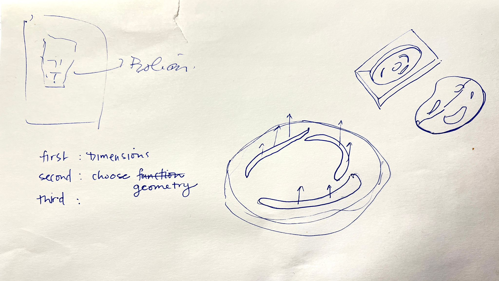
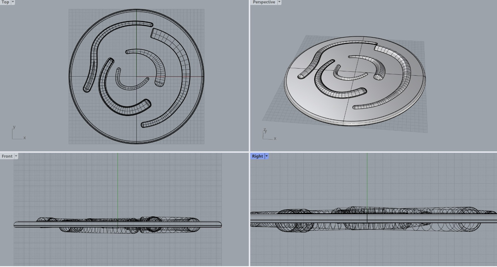

---
hide:
    - toc
---

# February 2nd 2023 : Design and Prototyping

**Reflection**

The Basics: 
This class was about understand the various softwares and newer trends but also chosing which software is best for us. 

There are various spheres of modelling. If you want to use any digitial fabrication equipment you need to know how to make digital files. We talked about design for manufactruing and fabrication, ie making designs that could exist in the real workd. 

Something new I learned: most of the time you need to jump between 2D and 3D and be comfortable with the switch. 

CAM - Computer Aided Manufacturing /machine → software for when you need to create a series of instructions for a machine. Cura  (as in Ultimaker Cura) is a CAM software →  you can’t create a shape on this but you can transform one.
For every machine there is likely a new CAM suite. 

CAD - Computer aided design → this is Rhino, Autocad etc. / this is where you create your shapes.

^^Assignment:Experiment with a Modelling software^^

I worked with Sami on the design of a plate for our upcoming biodesign dinner. Even though I took the precourse, and Sami had worked with Rhino for a jewelry course, we both had to relearn a lot of the commands. 

We first drew the plate on paper to agree on what the shape would be 

We then remembered we had to work with layer. So we created a cylinder which was our layer 1 and which we extruded. We then position tubes on top (our second layer)

