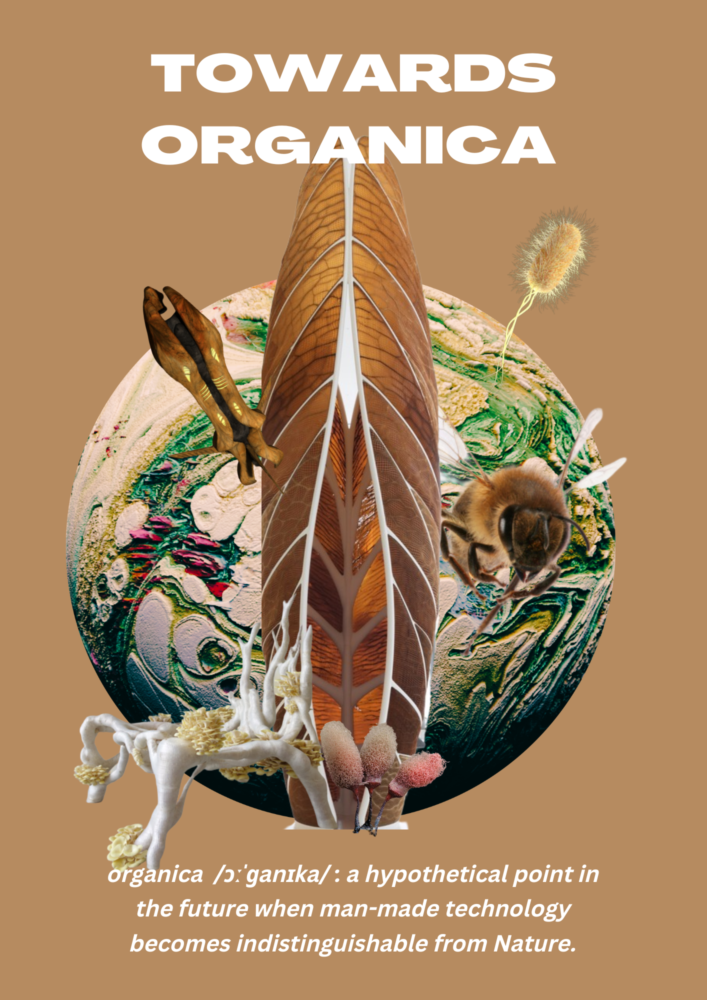
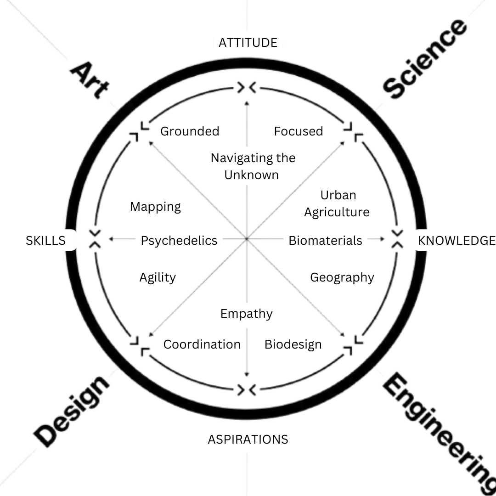
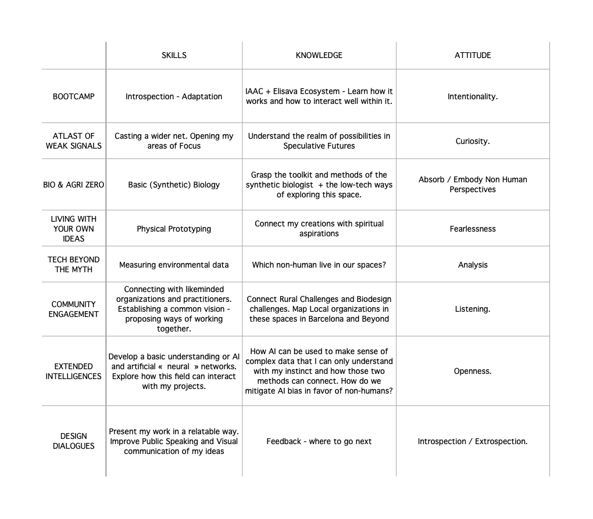

---
hide:
    - toc
---

#BOOTCAMP

**Poster**

^^Assignment: "Create a Poster that reflects your Fight"^^

Towards Organica is a narrative in development. As we go about our daily lives, most of the information we capture about the future shows disastrous fact; it shapes a storytelling that is ultimately crippling us. By emerging an optimistic balance point in our future, this narrative hopes to define a human/non-human equilibrium to aspire to. I use storytelling to shape my work {my fight} so as to create an embodied idea of the nebulous instincts that pull me; but also to communicate outwards and invite others on an adventure straddling the practical and speculative.

The imagery included in the poster shows famous biodesign projects and tools, from Neri Oxman’s Aguahoja to more obscure Star Trek references (the Bio-ship from Species 8472: literally an extension of the extraterrestrials’s bodies), all mythic experiments in storytelling, that I aspire to.

**Personal Development Plan**

^^Assignment: "Reflect on your skills, knowledge and attitude and create a personal development plan in line with the curriculum"^^

As I develop Electric Skin, I am learning what it takes to go develop a biodesign project. I am embodying my future user/customer. I am able to explore what challenges exist for artists and designers, how to connect to the scary world of biotech and labs, how to gain funding but also how to collaborate in interdisciplinarity. In my microprojects in MDEF I will be doing the same. Embodying. All of the hoops I have to jump through will help me be a better facilitator when I create this future Space. I will also be observing the skills of my teachers/professors.

To support these goals I also need to develop foundational knowledge in Design, Biology, and Digital Fabrication etc to be able to interface better with the community that exists in this world.

I am hoping to build connections in the region to establish my residency, as well as understand and deepen my understanding of what it takes to create a space for learning and enabling learning but also deliver impactful research. IAAC is also an inspiration on how to create an internationally renowned hub for cutting edge knowledge and I hope to learn from that set of skills.

In the table  below I’m also exploring how each week can help me create the various tools and toolkits that might be useful for the Biodesign Residency. Eg What is the minimum viable biolab? What frameworks enable us to work ethically with non-humans?

