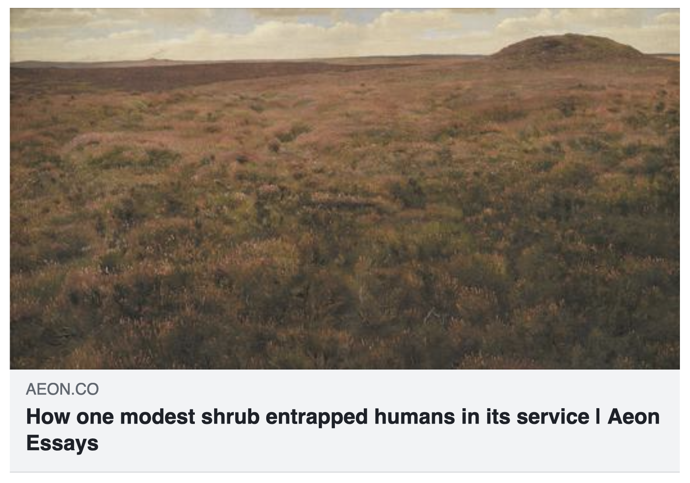

---
hide:
    - toc
---

# October 17th to 27th 2022 : Bio & Agri Zero



 

This section of the MDEF journey focuses on giving a condensed recap on the building blocks of biology, the scientific method and the ways designers can interact it. Nuria Conde Pueyo and Jordi Plat taught us the Biology part, each day unloading new swaths knowledge, some that I had previously interacted with and long forgotten and some entirely new relating to complex systems and the interaction between the scales of life. Jonathan Minchin then intervened on the Agriculture section, sharing his journey with projects ROMI and OpenSource  BeeHives. He honed in on the necessity of working with life - practically before conceptually.

 



I was particularly struck by the concept of Measure Transitions explained on the first day: The first measure transition is the appearance of Something from Nothing. The second measure transition is the appearance of unicellular life. What we consider life. The interaction of macromolecules leads to the third measure transition: Multicellular life. Some people consider a fourth measure transition which includes the appearance of organisms whose multicellular systems interact in complex systems: eg animals. Because of the interaction between bodies (complex multi-multicellular organisms), we can have a Cultural Evolution. And because of this, we are now able to change things. We are not a passive subjects of evolution we are an active participant. For example, we’ve developing knowledge in Synthetic Biology.

 



It left a question. What will be the next measure transition?

The course allowed us to learn about DIY Biology and Biolabs, Nuria having founded the one in Barcelona. She shared with us the basic equipment of a biolab and to each one, its hacked version. To me, that was very exciting: The fact that complex equipment can be reproduced on the cheap. the fact that biotech equipment becomes more and more affordable, and that many people are working on offering accesible versions, for science eduction. And the fact that designers can use these to start experimenting at home or DIY Labs.

 

<blockquote class="instagram-media" data-instgrm-permalink="https://www.instagram.com/p/CkYFb8pI226/?utm_source=ig_embed&amp;utm_campaign=loading" data-instgrm-version="14" style=" background:#FFF; border:0; border-radius:3px; box-shadow:0 0 1px 0 rgba(0,0,0,0.5),0 1px 10px 0 rgba(0,0,0,0.15); margin: 1px; max-width:540px; min-width:326px; padding:0; width:99.375%; width:-webkit-calc(100% - 2px); width:calc(100% - 2px);">
 <a href="https://www.instagram.com/p/CkYFb8pI226/?utm_source=ig_embed&amp;utm_campaign=loading" style=" background:#FFFFFF; line-height:0; padding:0 0; text-align:center; text-decoration:none; width:100%;" target="_blank"> 
 

 
 

 

 
<svg width="50px" height="50px" viewBox="0 0 60 60" version="1.1" xmlns="https://www.w3.org/2000/svg" xmlns:xlink="https://www.w3.org/1999/xlink"><g stroke="none" stroke-width="1" fill="none" fill-rule="evenodd"><g transform="translate(-511.000000, -20.000000)" fill="#000000"><g><path d="M556.869,30.41 C554.814,30.41 553.148,32.076 553.148,34.131 C553.148,36.186 554.814,37.852 556.869,37.852 C558.924,37.852 560.59,36.186 560.59,34.131 C560.59,32.076 558.924,30.41 556.869,30.41 M541,60.657 C535.114,60.657 530.342,55.887 530.342,50 C530.342,44.114 535.114,39.342 541,39.342 C546.887,39.342 551.658,44.114 551.658,50 C551.658,55.887 546.887,60.657 541,60.657 M541,33.886 C532.1,33.886 524.886,41.1 524.886,50 C524.886,58.899 532.1,66.113 541,66.113 C549.9,66.113 557.115,58.899 557.115,50 C557.115,41.1 549.9,33.886 541,33.886 M565.378,62.101 C565.244,65.022 564.756,66.606 564.346,67.663 C563.803,69.06 563.154,70.057 562.106,71.106 C561.058,72.155 560.06,72.803 558.662,73.347 C557.607,73.757 556.021,74.244 553.102,74.378 C549.944,74.521 548.997,74.552 541,74.552 C533.003,74.552 532.056,74.521 528.898,74.378 C525.979,74.244 524.393,73.757 523.338,73.347 C521.94,72.803 520.942,72.155 519.894,71.106 C518.846,70.057 518.197,69.06 517.654,67.663 C517.244,66.606 516.755,65.022 516.623,62.101 C516.479,58.943 516.448,57.996 516.448,50 C516.448,42.003 516.479,41.056 516.623,37.899 C516.755,34.978 517.244,33.391 517.654,32.338 C518.197,30.938 518.846,29.942 519.894,28.894 C520.942,27.846 521.94,27.196 523.338,26.654 C524.393,26.244 525.979,25.756 528.898,25.623 C532.057,25.479 533.004,25.448 541,25.448 C548.997,25.448 549.943,25.479 553.102,25.623 C556.021,25.756 557.607,26.244 558.662,26.654 C560.06,27.196 561.058,27.846 562.106,28.894 C563.154,29.942 563.803,30.938 564.346,32.338 C564.756,33.391 565.244,34.978 565.378,37.899 C565.522,41.056 565.552,42.003 565.552,50 C565.552,57.996 565.522,58.943 565.378,62.101 M570.82,37.631 C570.674,34.438 570.167,32.258 569.425,30.349 C568.659,28.377 567.633,26.702 565.965,25.035 C564.297,23.368 562.623,22.342 560.652,21.575 C558.743,20.834 556.562,20.326 553.369,20.18 C550.169,20.033 549.148,20 541,20 C532.853,20 531.831,20.033 528.631,20.18 C525.438,20.326 523.257,20.834 521.349,21.575 C519.376,22.342 517.703,23.368 516.035,25.035 C514.368,26.702 513.342,28.377 512.574,30.349 C511.834,32.258 511.326,34.438 511.181,37.631 C511.035,40.831 511,41.851 511,50 C511,58.147 511.035,59.17 511.181,62.369 C511.326,65.562 511.834,67.743 512.574,69.651 C513.342,71.625 514.368,73.296 516.035,74.965 C517.703,76.634 519.376,77.658 521.349,78.425 C523.257,79.167 525.438,79.673 528.631,79.82 C531.831,79.965 532.853,80.001 541,80.001 C549.148,80.001 550.169,79.965 553.369,79.82 C556.562,79.673 558.743,79.167 560.652,78.425 C562.623,77.658 564.297,76.634 565.965,74.965 C567.633,73.296 568.659,71.625 569.425,69.651 C570.167,67.743 570.674,65.562 570.82,62.369 C570.966,59.17 571,58.147 571,50 C571,41.851 570.966,40.831 570.82,37.631"></path></g></g></g></svg>

 
Voir cette publication sur Instagram

 

 

 

 

 

 

 

 

 

 
 

 

</a>
<a href="https://www.instagram.com/p/CkYFb8pI226/?utm_source=ig_embed&amp;utm_campaign=loading" style=" color:#c9c8cd; font-family:Arial,sans-serif; font-size:14px; font-style:normal; font-weight:normal; line-height:17px; text-decoration:none;" target="_blank">Une publication partagée par Paige Perillat (@paigeperill)</a>

</blockquote> 

 




Our homework for this course was to chose a journalistic article somehow relating to biology or agriculture and comment on it + tie it to existing scientific articles.



I chose an essay from Aeon, an online publication with a philosophical focus. Its title: **«Mutual entrapment: As Neolithic people transformed prehistoric forests, they stumbled into an ecological trap. Domestication goes both ways »**

 

The article is beautiful, well written. It starts with a portrait of Neolithic times, describing the scene of a forest clearing by Neolithic peoples and how that action allows for Heather to proliferate freely: the fire activating its seeds for the next spring.

 

The author: Mette Løvschal , goes on to describe how this scene, while it may be seen as the domestication of a landscape, could also be thought of as the beginning of a long period of mutual entrapment.

 *« Among the first forest clearings, we see early humans engaging in a new form of worldmaking, unaware that in some distant future this changed landscape would lock its domesticators into trajectories of care and maintenance from which it will become almost impossible to escape »*.

 

Indeed, when we look at the literature, we find several papers that studied heather and its « fire response ». Some varieties of heather almost demand to be burned for their seeds to spread properly, while others don’t. The varieties that have a fire response correlate to deep time patterns in human activity [Vandvik, Vigdis & Töpper, Joachim & Cook, Zoë & Daws, Matthew & Heegaard, Einar & Måren, Inger & Velle, Liv. (2014). Management-driven evolution in a domesticated ecosystem. Biology Letters. 10. 10.1098/rsbl.2014.0156. ] proving a history of coevolution, and arguably, mutual domestication.

 


*«  The heathlands of the Holocene were anthropogenic. The sunlight and fire were not gifts of a changing climate. They were bestowed by Neolithic agro-pastoralists who began felling and burning the understory to make forest clearings. [...] It couldn’t be left alone. Heather now depended on the focused attention of people, on frequent grazing by the animals of pastoralists, and on fire to prevent its botanical competitors, such as birch and crowberry, from taking over the new sun-lit clearings.  »*.

 

The article reminded me of the concept of the Anthropocene, and the debate over when it can be deemed to have started. Was it back then? Nuria gave a definition in class that was interesting, she felt it meant that « we have changed the environment enough that we are active agents of evolution. We force other living organisms on earth to survive or die in our landscape forming». This article argues that Anthropocene or not, the changes we make on our landscape lock us in patterns of mutual dependency, and suggests that we are not fully conscious agents of the changes we make. In other words, our inability to think in deep time has locked us a myriad of systems of domestication that may not serve us. These patterns are ongoing, and in creation: *« We have become entrapped in an unethical, unsustainable and damaging high-fertility production apparatus, with its own logic of expansion. Even the infrastructures that make agricultural production possible involve an ever-expanding formation of consultants, subsidy schemes, education, science, materials and technologies. But domestication never gives free gifts. The costs are high – and inflective. They turn back on us »*.



 

Løvschal’s view is not optimistic. And the story he tells is important. As we move into territories of genetic engineering, it becomes even more imperative to understand how human interventions on species and landscape change society, and the pattern these changes lock us into. But is this even possible? There are limits to the human brain after all. Could technologies like AI or quantum computing help us predict the deep time ways in which ongoing domestications will trap us?

And even further, could we more away from patterns of domestication but instead into conscious Interspecies Collaboration? What would that even mean? To be explored…
