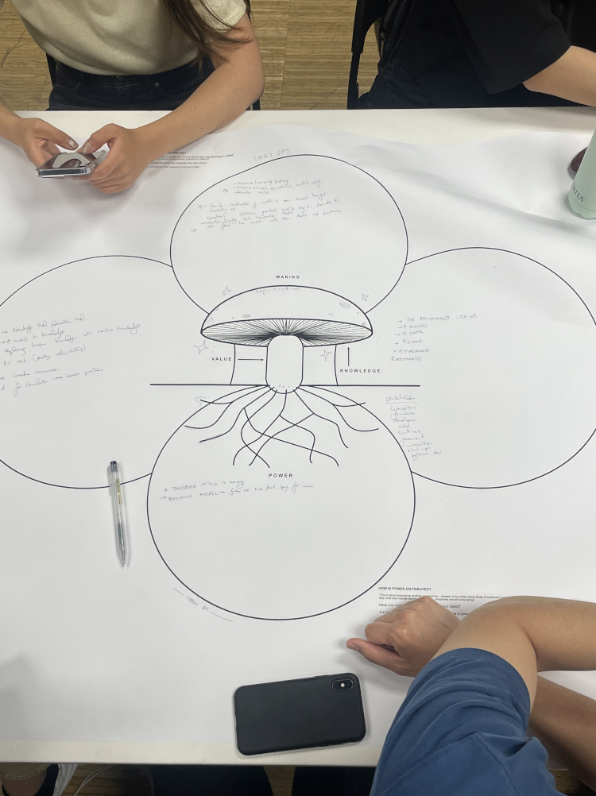
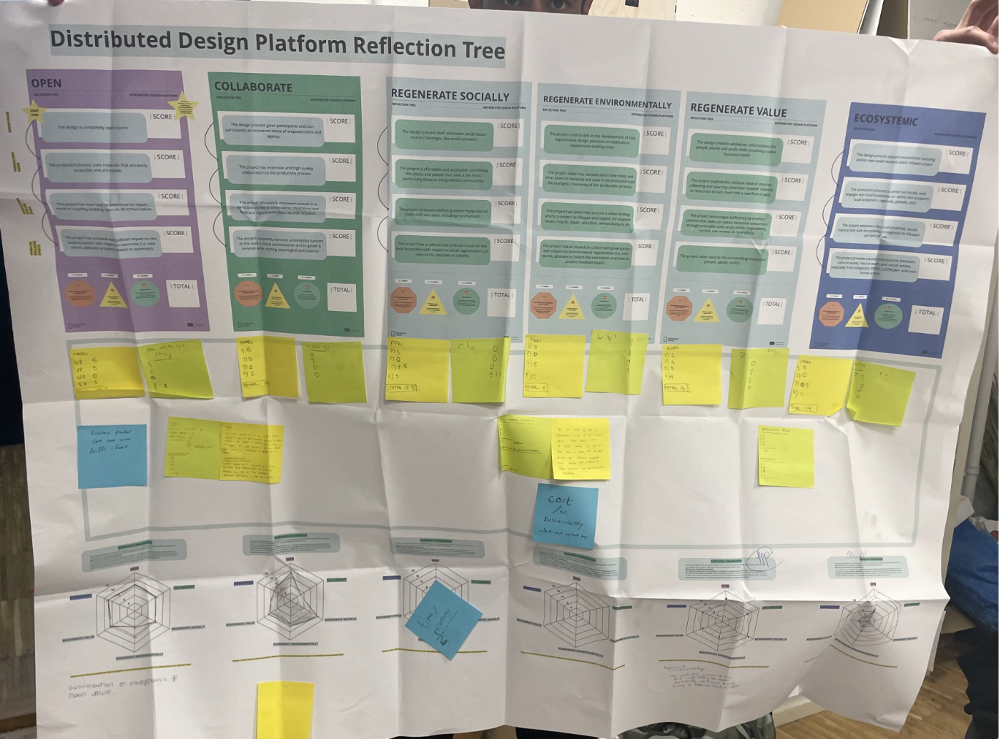
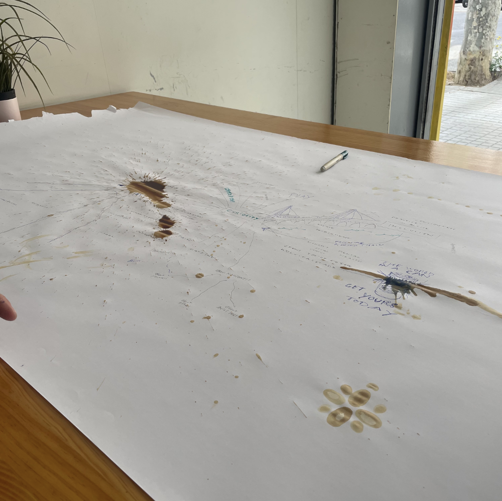

---
hide:
    - toc
---

# April 11th to 14th 2023 : Distributed Design

**Reflection**

^^Learning Skills: Which skills did I need during the activity and how can I translate into something useful for me and my future?^^
Previous knowledge about machine learning and AI + data storage 

^^Dynamics: How was the dynamic inside the group?^^
Collaborative, sharing, playful, ping-pong, riffing 

^^Interactions: Did the role I played influence my opinion?^^
I didn’t feel like I had any particular role. More a passenger playing along in a game. Without a personal subject to apply it to, it was difficult to be very engaged. It also reminded me of future proofing methodologies. 

 

^^Learning Skills: Which skills did I need during the activity and how can I translate into something useful for me and my future?^^
Previous knowledge about machine learning and AI + data storage 

^^Dynamics: How was the dynamic inside the group?^^
Collaborative, sharing, playful, ping-pong, riffing 

^^Interactions: Did the role I played influence my opinion?^^
I didn’t feel like I had any particular role. More a passenger playing along in a game. Without a personal subject to apply it to, it was difficult to be very engaged. It also reminded me of future proofing methodologies. 

 

^^Learning Skills: Which skills did I need during the activity and how can I translate into something useful for me and my future?^^
Previous knowledge about machine learning and AI + data storage 

^^Dynamics: How was the dynamic inside the group?^^
Collaborative, sharing, playful, ping-pong, riffing 

^^Interactions: Did the role I played influence my opinion?^^
I didn’t feel like I had any particular role. More a passenger playing along in a game. Without a personal subject to apply it to, it was difficult to be very engaged. It also reminded me of future proofing methodologies. 
