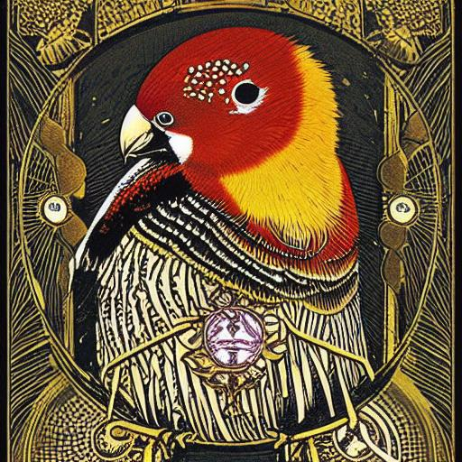

---
hide:
    - toc
---

# April 11th to 14th 2023 : Distributed Design

**Reflection**

Limited Edition Tarot card of Umwelt, from the Interspecies Tarot Deck, showing a zebra finch with a subtle glow around its head to highlight its sensitivity to magnetic fields, magnetoreception mechanism, and protein CRY4. The card also includes a small illustration of the Earth's magnetic field and a diagram of how the protein CRY4 works. Art by Mattias Adolfsson, inspired by Ryan Mandell's research.